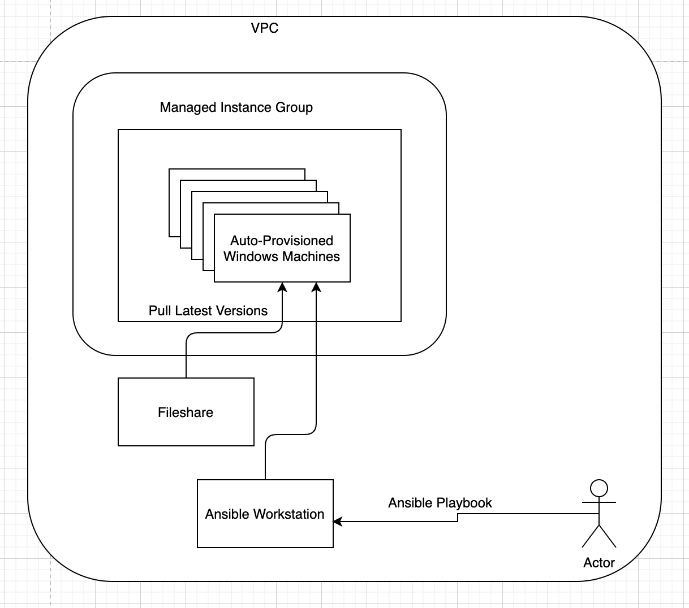

## Overview

Google Cloud Platform Managed Instance Group alone with Global LoadBalancing options provides you capabilities to scale your workloads based on resource utilization. You setup an image that will be used to provisioning new machines, configure how your workloads should scale, and Google Cloud Platform automatically scales up or down when resource utilization goes up or down.

This feature not only release your IT teams from monitoring resource utilization and worklaod status, also gives your engineering teams powerful tool to focus on application and business requirements, building great apps.

However, everything come with a trade-off, moving from a traditional workload model to an auto-scaling model, some changes may need to be made to your application.

Your application may need to become stateless in order to be able to easily scale.

Your application may need to be able to shutdown gracefully and resume where they left in order to continue serving your customers.

Your operation and release process will be different. The assumption of auto-scaling is that every machines are identical, they can be take down in any order without effecting your workloads and brining up in any order without user notice any differences. 

## The Problem

It is common for a company release frequently, in Managed Instance Group, you create a new image, kick-off rolling updates to update machines in managed instance group to release new versions.

Creating a base image takes time, depends on what is your workload, how it is developed and released, it can take hours to create an image. Now, if your company releases a new version or minor updates every couple week, this can become a nightmare.

To keep up with release pace while minimize your IT and Engineering team's loading, their several approaches to continously integrate and deliver applications to GCP Managed Instance Group. Google has released [a paper](https://cloud.google.com/solutions/deploy-dotnet-applications) to address difference approaches which covers from Build, Test to Deploy.

In this document, I will be mainly focus on the "deploy" part of it.

## What are we solving ?

Considering of an traditional ASP.Net application running on virtual machines that releases every couple weeks regularly, and minor updates might need to be applied to production environment on demend.

The application itself runs on managed instance group to utlizie auto-scaling mechanism.

How can we keep our release pace without having to waste too much time of our engineering and IT teams ?

## How are we solving ?

We will use both push and pull mode that mentioned in above [paper](https://cloud.google.com/solutions/deploy-dotnet-applications). Below is a high-level architecture of this solution. Buid and Testing parts are not included.

An high-level architecture we will be building showing below

## What and Why are we choosing these services ?

Several different technologies are involved here

|Component|Feature|
|:--:|:--:|
|Ansible|Windows Support  Agentless Push and Pull |
|Managed Instance Group|Auto-Scaling Start up Script to pull new version when provisiong|

-   Ansible is a popular configuration management tool which works with Linux and Windows. It does not require agents installed on target machines. In our case, we also want to leverage its push deployment model.

-   Since the application leverage auto-scaling mechanism to handle incoming traffic, machines can be provisioned and deleted, we need a way to dynamically detect newly created machines instead of having client machines register themselves to a server. Ansible in this scenario provides dynamic inventory addressed this concern.

Next,I will be detailing steps to setup this solution.

#### Next Steps
[Configure Windows Environemnt and Create Instance Template](./setup-windows-host-image.md)

[Setup Ansible Workstation to manage Managed Instnace Group](./setup-ubuntu-ansible-server.md)

[Working with Playbooks](./setup-playbooks.md)

## References
---

[Ansible Dynamic Inventory](https://docs.ansible.com/ansible/latest/user_guide/intro_dynamic_inventory.html)

[Ansible Google Cloud Platform Guide](https://docs.ansible.com/ansible/latest/scenario_guides/guide_gce.html)

[Setup Ansible Windows hosts](https://docs.ansible.com/ansible/latest/user_guide/windows_setup.html)

[Using Ansible and Windows](https://docs.ansible.com/ansible/latest/user_guide/windows_usage.html)

[win_iis_weebsite - Configures a IIS Web Site](https://docs.ansible.com/ansible/latest/modules/win_iis_website_module.html)

[Ansible - GCP dynamic inventory 2.0 - by Artem Yakimenko](https://medium.com/@Temikus/ansible-gcp-dynamic-inventory-2-0-7f3531b28434)